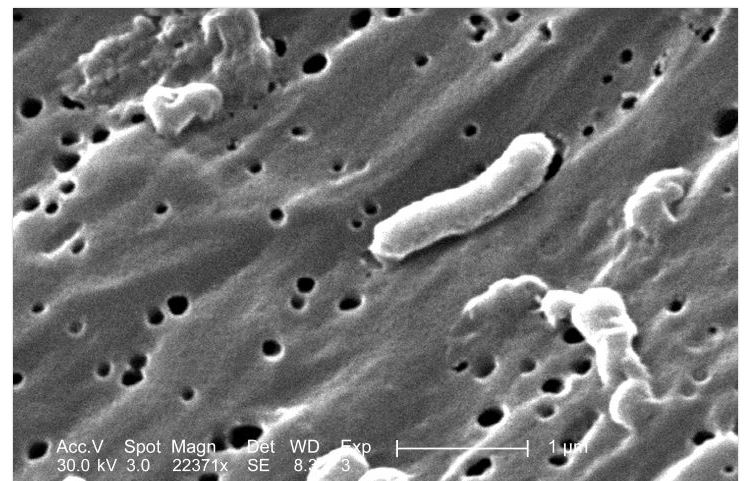
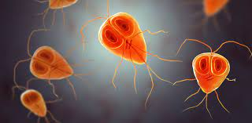
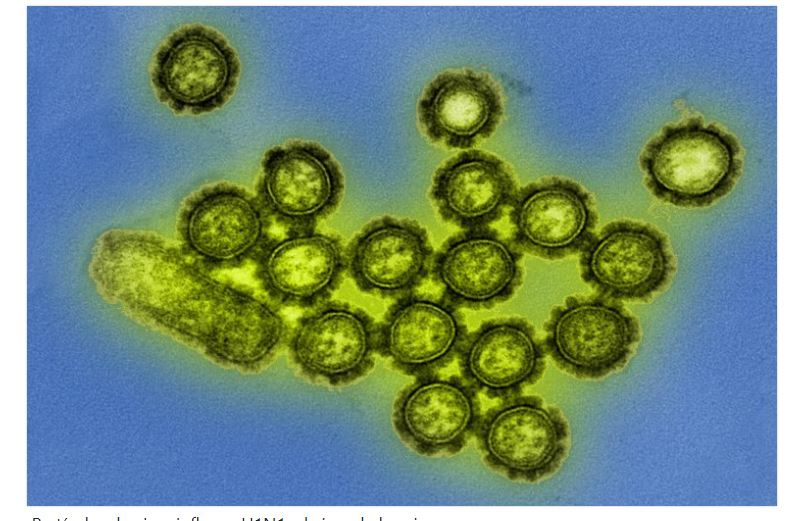
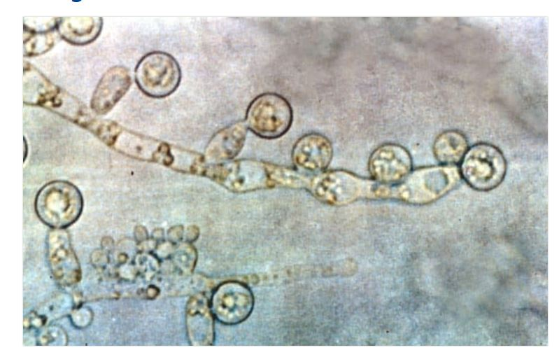
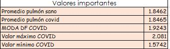
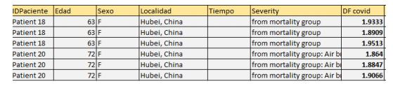
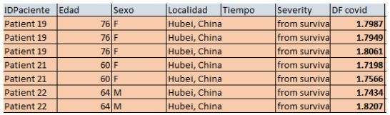
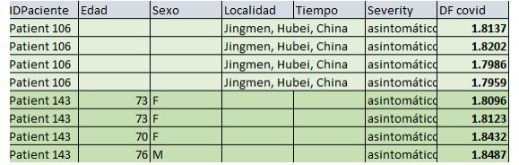
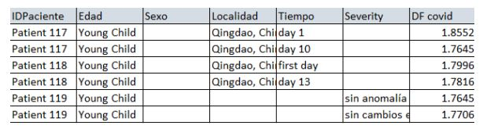
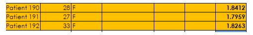

<html>

 <h1> <i>    Las grandes consecuencias de los pequeños patógenos    </i></h1>
 
 <link rel="shortcut icon" href="/static/img/favicon-32x32.png" type="image/x-icon">
  
  
 <h2><b>Coinfección por pátogenos respiratorios y su impacto en el pronóstico de mortalidad de pacientes con COVID-19. </b></h2>
    
 <body style="background-color:rgba(255,0,0,0.5);">

  <h3><b>Introducción</b> </h3>

 Para abordar el tema principal, es necesario tener conceptos que seran la clave para una comprensión idónea. 
 
La microbiología es el estudio de los microorganismos su forma, estructura, fisiología, reproducción, metabolismo etc. 
  
 Su objetivo principal es comprender las reacciones que pueden ser buenas o malas en un húesped, haciendo que  se busque una forma de aumentar los beneficios y disminuir los daños que este provocan.
  

                                                               
 <i>    ¿qué es un patógeno?       </i>       
  

 
Estos pequeños amiguitos son unos súper agentes infecciosos que pueden provocar  diferentes enfermedades en el cuerpo.
Existen diferentes tipos de patógenos como las siguientes:

 
   
<li>Bacterias: son procariotas, lo que quiere decir que tienen una membrana celular y  tienen una forma esférica o cilíndrica.</li>
  
   
   
   
<li> Parásitos: pueden ser uni o multicelulares, pequeños microorganismos necesitan de un huésped para sobrevivir, además que su modo de reproducirse es de manera sexual y asexual.</li>

   
   
<li> Virus: son organismos infecciosos que no son considerados células y que al igual que los parásitos, necesitan de un húesped para sobrevivir. Esta compuesto por ADN y ARN.</li>
  
   
 
<li>Hongos: son eucariotas, causan infecciones a nivel superficial o profundo. También como los parásitos, pueden ser  uni o multicelulares denominandolos seres heterótrofos; su forma de reproducirse es por medio de esporas.</li>
    
   
 

Un panel de patógenos respiratorios (también llamado perfil PR) busca si hay patógenos en el sistema respiratorio.

Actualmente, el mundo experimenta un desafío sanitario de gran envergadura, que exige hasta el extremo las estructuras sanitarias, productivas y sociales en todo el mundo.[1]
 
La coinfección por dos o más patógenos respiratorios comunes podría dificultar un diagnóstico de recuperación de la infección producida por el virus SARS-CoV-2.
   
Es por ello que se proponen diferentes tipos de posibles soluciones que ayuden a contribuir a uno de los 17 Objetivos de Desarrollo Sostenible (ODS) pertenecientes a la Organización de las Naciones Unidas(ONU). 
  
 <i>¿Cómo relacionan el tercer objetivo: SALUD Y BIENESTAR con la coinfección por pátogenos respiratorios y su impacto en el pronóstico de mortalidad en pacientes con COVID-19?</i> [2][3]. 
   
Este tercer objetivo tiene como fin garantizar una vida sana y promover el bienestar para todos en todas las edades en esta crisis mundial que trae consigo el sufrimiento y muchas cadenas de consecuencias.
Para la organización mundial de la salud (OMS) y la Organización de las naciones Unidas, la COVID-19 es una emergencia sanitaria causada por un pequeño patógeno, es por ello que este proyecto busca tener enfoque en disminuir la tasa de mortalidad por COVID-19.[4]
   
<i>¿Quién pensaría que un pequeño microorganismo fue capaz de hacer una pandemia que llevaría a confinarnos hasta la actualidad?</i>
  Es allí donde las grandes consecuencias de los pequeños patógenos.

 
  

  <h3><b> Métodología </b> </h3>

La base primordial para la elección de un proyecto es basado en seguir los siguientes pasos de manera cronológica:
   
 
 <li>Seleccionar un tema.</li>
 
 
<li>Identificar un problema del tema seleccionado.</li>
 
  
<li>Definir e investiga del problema</li>
   
<li>Investigar antecedentes.</li>

<li>Crear una hipotésis.</li>
   
<li>Probar hipotésis mediante algoritmos de dimensión fractal de imagenes de CT de pulmones.</li>
  
<li> Analizar resultados obtenidos.</li>
   
<li>Realizar una conclusión.</li>
   
<li>Hacer un vídeo.</li>
    

  <h3><b> Antecedentes.</b></h3>
La COVID-19 es una enfermedad causada por un virus de la familia de los coronavirus que fue descubierto a finales de noviembre de 2019 en Wuhan, China.
El SARS-CoV2 entra en las células de los alveolos (los neumocitos) y utiliza el contenido que hay dentro de ellas para multiplicarse de forma masiva, hasta matar a la célula en la que se encuentra. Al multiplicarse, el virus acaba con estos neumocitos y por eso se dificulta mucho el trabajo que deben realizar en cada inspiración para que el oxígeno llegue a la sangre y se reparta a todos los órganos del cuerpo.
La destrucción de los alveolos genera una respuesta de nuestro sistema de defensa en forma de inflamación.
 
La mortalidad de los pacientes infectados con COVID-19 suele estar alrededor del 5% y, en pacientes hospitalizados, la mortalidad puede llegar al 30%. 
                      
  La variabilidad de este y otros indicadores puede deberse a la presencia de otras condiciones como las coinfecciones respiratorias. Se han reportado la presencia de coinfecciones en alrededor del 10 a 12,5% de pacientes hospitalizados por COVID19. [5]
   
   
Se han realizado varios trabajos que estudian la efectividad de las tomografías computarizadas en la detección y prueba de COVID-19 y los resultados son prometedores. 
   
 Sin embargo, debido a problemas de privacidad, las tomografías computarizadas utilizadas en estos trabajos no se comparten con el público. Esto dificulta enormemente la investigación y el desarrollo de métodos de IA más avanzados para realizar pruebas más precisas de COVID-19 basadas en CT.
  
  
Objetivo principal: Evaluar la frecuenciade recuperación por  coinfección con patógenos respiratorios bacterianos y virales detectados en  mediante algoritmos de estimación de la dimensión fractal de las imagenes de tomografía computarizada (CT) en pulmones de personas con COVID-19.

  <h3><b>Hipotésis.</b></h3>
Los pacientes que muestran una dimensión fractal más alto del promedio de un pulmón sano, pertenecen a un grupo severo de COVID-19,tendiendo a causar coinfección con más patógenos.

<h3><b>Comprobación de la hipotésis.</b></h3>
Para comprobar nuestra hipotésis, hemos trabajado con una base de datos extraída de "Towards data science" llamada: COVID-CT-Dataset: A CT Scan Dataset about COVID-19. En la cual, fomenta la investigación de la IA en el uso de las CT para combatir la COVID-19.[6]
La base de datos contiene 349 tomografías  computarizadas  de pulmones positivas para COVID-19 y 396 muestras de pulmones sanos, ambas tienen su correspondiente archivo excel.[7]
   
  
   
Sin embargo, el excel de nuestro mayor interés es el de los pacientes positivos a SARS-COV-2, ya que en él se encuentran datos esenciales para nuestra investigación tales como:
   
   
1.Número de dentificación del paciente.
   
  
2. Edad.
   
 
3. Sexo
   
  
4. Lugar
   
  
5. Tiempo desde que se presentaron los síntomas.
   
 
6. Gravedad del paciente.
   
  

Después de tener a nuestra disposición la base de datos, se procedió a calcular la dimensión fractal de nuestros pulmones sanos y pulmones dañados con una programación en Matlab la cuál fue desarrollado por el Doctor Omar Alejandro Olvera Guerrero quien tiene un posgrado en Ciencias y Tecnologías de la Información. Él impartió la materia de procesamiento de señales biomédicas  en la Universidad Politécnica de Chiapas y fue allí donde explicó la importancia del cálculo de las dimensaiones fractales aportados a las ciencias médicas.
   
El código y los archivos excel, se encuentran en el repositorio siguiente: "https://github.com/Nancyfsg/CdeCiencia".
  

<h3><b> Resultados </b></h3>
Se cálculo el promedio de los pulmones sanos arrojando 1.84615929 además de obtener un valor mínimo de 1.5742 y teniendo un 2.081 como valor máximo de DF de pulmones dañados.

Inició la comparación del promedio de los pulmones sanos con cada resultado obtenido de cada estudio de CT de pacientes con COVID-19. En donde se demostró que 189 de las 349 muestras de CT, estuvieron por encima del promedio haciendo que este sea un 54.15% del total de las muestras.
   
  
   
De acuerdo a la descripción, se clasifico y se observaron los resultados de la siguiente manera:
   
Se destacó el Grupo de mortalidad de acuerdo a su descripción, ya que en estos se pudo observar  que lamentablemente estas personas tuvieron un DF mayor al promedio:
   
  
 
A comparación del grupo de sobreviviente de acuerdo a su descripción, estos presentaron un DF menor al rango del promedio:
 
  
   
Pacientes quienes de acuerdo a su descripción mostraron ser asintomáticos, la mayoria de estos, siempre estaban cerca al rango del promedio de covid:
   
  
   
 Fue raro encontrar pacientes siendo niños y la mayoría de estos, manejaban debajo del rango:
   
  
   
 Por último, los pacientes con covid19 embarazadas fue también un resultado que destacar por el hecho de estar en esta situación y aunque 2 de 3 se acercó al rango normal de covid:
 
  
   
<h3><b>Conclusiones </b></h3>

A nuestra consideración como equipo y como antes se explicó, podría existir una posibilidad de hacer notar una mejoría hacia la recuperación del paciente y poder observar también un posible grado de mortalidad, esto de acuerdo a la comparación del promedio de las pruebas de pulmón con covid. 
   
  Con esto, se podría comprobar la hipótesis y concluyendo que, si la DF de la imagen es mayor al del promedio, podría estar en una situación severa, ya que los alveolos estarían  llenos de flujos provocando que sean propensos a nuevos patógenos respiratorios como: neumonía  entre otras infecciones respiratorias provocando riesgo de sufrir más complicaciones. 
  

Hay que agregar que el cálculo de las dimensiones fractales en las ciencias médicas mediante muestras de tomografías aún no es un campo completamente amplio porque podemos tener una aproximación en cuanto a la probabilidad de que lo que estamos viendo sea coninfecciones de infecciones respiratorias a consecuencia del SARS-COV-2 o también que nuestras tomas no sean completamente clara a causa de opacidad focal, tenue, aumento de densidad difuso tenue y sea inapropiado para utilizarlo con la DF; por lo que se sugiere seguir investigando y probando diferentes métodos químicos o del gabinete de imagenología ya que no debemos descartar ciertos posibles diagnósticos porque cada uno muestra diferentes resultados desde sus diferentes perspectivas y con ello tendríamos mejores cuadros clínicos.
 

<h3><b>Referencias bibliográficas.</b></h3>
[1] Cruz, M. P., Santos, E., Cervantes, M. V., & Juárez, M. L. (2021). COVID-19, una emergencia de salud pública mundial. Revista Clínica Española, 221(1), 55-61.
    
[2] Quiñones-Laveriano, D. M., Soto, A., & Quilca-Barrera, L. (2021). Frecuencia de coinfección por patógenos respiratorios y su impacto en el pronóstico de pacientes con COVID-       19. Revista de la Facultad de Medicina Humana, 21(3).
    
[3] Xing, Q. (2020, 1 enero). Precautions are Needed for COVID-19 Patients with Coinfection of Common Respiratory Pathogens. MedRxiv.                                                   https://www.medrxiv.org/content/10.1101/2020.02.29.20027698v2.full
    
[4] Moran, M., Moran, M., Moran, M., & M. (s. f.). Salud. Desarrollo Sostenible. Recuperado 19 de agosto de 2021, de https://www.un.org/sustainabledevelopment/es/health/
    
[5] Tarazona, S. T., & Valdivia, A. V. (2020, 1 mayo). Coinfección por patógenos respiratorios virales y bacterianos detectados por métodos moleculares en pacientes hospitalizados por COVID-19 y su impacto en la mortalidad y desenlaces desfavorables. Universidad Ricardo Palma. https://repositorio.urp.edu.pe/handle/URP/3035
    
[6] Xie, P. (2020b, abril 5). COVID-CT-Dataset: A CT Scan Dataset about COVID-19 - Towards Data Science. Towards Data Science.
    https://towardsdatascience.com/covid-ct-dataset-a-   ct-scan-dataset-about-covid-19-fb391de55ae6
    
[7] U. (s. f.-a). GitHub - UCSD-AI4H/COVID-CT: COVID-CT-Dataset: A CT Scan Dataset about COVID-19. GitHub. Recuperado 19 de agosto de 2021, de
    https://github.com/UCSD-AI4H/COVID-CT
    

 
<h4><b>Equipo </b></h4>

* Estudiante 1: Nancy Solís Grajales.
   
* Estudiante 2: Lilián Michelle Lopez Carrasco
 
 </body>
</html>
